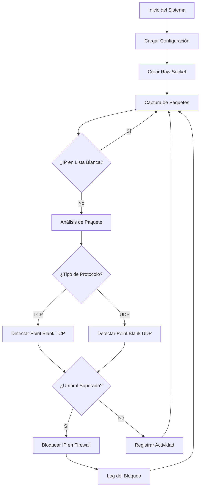

# 🛡️ Advanced Anti-DDoS Protection System

<div align="center">


**Sistema avanzado de protección contra ataques DDoS con detección específica de Point Blank Socket y análisis de tráfico en tiempo real**

[Características](#-características) • [Instalación](#-instalación) • [Configuración](#-configuración) • [Uso](#-uso) • [Arquitectura](#-arquitectura)

</div>

---

## 📋 Descripción

Sistema anti-DDoS de nivel empresarial desarrollado en C# que proporciona protección en tiempo real contra ataques distribuidos de denegación de servicio. Implementa técnicas avanzadas de análisis de paquetes, detección de patrones maliciosos y bloqueo automático a nivel de firewall.

### 🎯 Características Principales

- **🔍 Análisis de Tráfico en Tiempo Real**: Monitoreo continuo usando raw sockets para captura de paquetes IP
- **🚫 Detección Específica Point Blank Socket**: Algoritmos especializados para detectar este tipo de ataque
- **⚡ Bloqueo Automático**: Integración con Windows Firewall para bloqueo inmediato de IPs maliciosas
- **📊 Estadísticas Avanzadas**: Dashboard en tiempo real con métricas detalladas de tráfico
- **🔧 Configuración Flexible**: Sistema de configuración INI para personalización completa
- **📝 Logging Completo**: Registro detallado de todos los eventos y ataques detectados
- **🛡️ Lista Blanca Inteligente**: Protección automática de IPs locales y confiables

---

## 🚀 Características Técnicas

### Detección Multi-Capa

| Tipo de Detección | Descripción | Umbral Configurable |
|-------------------|-------------|---------------------|
| **Frecuencia de Peticiones** | Análisis de rate limiting por puerto | ✅ |
| **Conexiones TCP Rápidas** | Detección de patrones de conexión Point Blank | ✅ |
| **Paquetes UDP Maliciosos** | Análisis de firmas y patrones sospechosos | ✅ |
| **Paquetes Vacíos** | Detección de paquetes TCP/UDP sin contenido | ✅ |
| **Ataques Distribuidos** | Análisis cross-port para ataques coordinados | ✅ |

### Algoritmos de Detección

```csharp
// Ejemplo de detección Point Blank TCP
private static void DetectPointBlankTCPAttack(string sourceIP, byte[] buffer, int received, int headerLength)
{
    // Análisis de conexiones rápidas consecutivas
    TimeSpan elapsed = now - lastTcpConnectionTime[sourceIP];
    
    if (tcpConnectionAttempts[sourceIP] >= tcpConnectionThreshold && elapsed.TotalSeconds <= tcpConnectionInterval)
    {
        BlockIP(sourceIP, port, attempts, timestamp, "Point Blank Socket TCP Attack");
    }
}
```

---

## 🛠️ Instalación

### Requisitos del Sistema

- **OS**: Windows 10/11 o Windows Server 2016+
- **Framework**: .NET Framework 4.7.2 o superior
- **Privilegios**: Ejecutar como Administrador (requerido para raw sockets y firewall)
- **Puertos**: Acceso a raw sockets (requiere privilegios elevados)

### Pasos de Instalación

1. **Compilar el proyecto**
   ```bash
   # Clonar el repositorio
   git clone https://github.com/jgenoss/antiddos-system.git
   cd antiddos-system
   
   # Compilar con Visual Studio o CLI
   dotnet build --configuration Release
   ```

2. **Ejecutar como Administrador**
   ```cmd
   # Ejecutar con privilegios elevados
   Run as Administrator: AntiDDoS.exe
   ```

3. **Configuración inicial**
   - El sistema creará automáticamente `config.ini` con valores predeterminados
   - Personalizar según necesidades del entorno

---

## ⚙️ Configuración

### Archivo config.ini

```ini
# Configuración de Red
LocalIP=127.0.0.1                    # IP local a proteger
Ports=80,443,8080,3000               # Puertos a monitorear

# Límites de Detección
RequestLimit=50                       # Peticiones máximas por intervalo
Interval=5                           # Intervalo de tiempo (segundos)

# Lista Blanca
Whitelist=192.168.1.1,127.0.0.1     # IPs confiables

# Configuración Point Blank
TCPConnectionThreshold=10             # Umbral conexiones TCP rápidas
TCPConnectionInterval=2               # Intervalo para conexiones TCP (seg)
EmptyPacketThreshold=5               # Umbral paquetes vacíos consecutivos
```

### Configuración Avanzada

| Parámetro | Descripción | Valor Recomendado |
|-----------|-------------|-------------------|
| `RequestLimit` | Máximo de peticiones por IP/puerto | 50-100 |
| `Interval` | Ventana de tiempo para análisis | 5-10 segundos |
| `TCPConnectionThreshold` | Conexiones TCP antes de bloqueo | 8-15 |
| `EmptyPacketThreshold` | Paquetes vacíos consecutivos | 3-8 |

---

## 📖 Uso

### Inicio del Sistema

```cmd
# Ejecutar como Administrador
AntiDDoS.exe

# Output esperado:
Anti-DDoS mejorado iniciado... Escaneando tráfico en 192.168.1.100
IPs en lista blanca: 192.168.1.1, 127.0.0.1, 192.168.1.100
Configuración: Límite=50 peticiones en 5 segundos
Protección específica contra Point Blank Socket activada
```

### Monitoreo en Tiempo Real

El sistema proporciona información continua:

```
[14:30:15] Detección: IP=192.168.1.50 | Puerto=80 | Peticiones: 45/50
[14:30:16] ALERTA: Posible ataque detectado en puerto 80 desde IP 192.168.1.50 (52 peticiones)
[14:30:16] IP BLOQUEADA: 192.168.1.50 | Tipo: Ataque de frecuencia por puerto
```

### Estadísticas Automáticas

Cada minuto se muestran estadísticas detalladas:

```
--------- ESTADÍSTICAS DE TRÁFICO ---------
Timestamp: 2024-12-21 14:31:00
IPs activas: 5
IPs bloqueadas: 2
IPs en lista blanca: 3

Puertos más activos:
- Puerto 80: 156 peticiones totales
- Puerto 443: 89 peticiones totales
- Puerto 8080: 23 peticiones totales

Top IPs más activas:
- 192.168.1.45: 67 peticiones totales
  - Puerto más activo: 80 (45 peticiones)
```

---

## 🏗️ Arquitectura del Sistema

### Diagrama de Flujo



### Componentes Principales

| Componente | Responsabilidad | Hilo |
|------------|-----------------|------|
| **MonitorTraffic()** | Captura y análisis de paquetes raw | Principal |
| **ProcessRequest()** | Análisis de frecuencia de peticiones | Principal |
| **DetectPointBlankTCPAttack()** | Detección específica TCP Point Blank | Principal |
| **DetectPointBlankUDPAttack()** | Detección específica UDP Point Blank | Principal |
| **ShowStatistics()** | Estadísticas en tiempo real | Secundario |
| **MonitorFirewallRules()** | Monitoreo de reglas de firewall | Secundario |

---

## 🔒 Características de Seguridad

### Protecciones Implementadas

- **🔐 Raw Socket Security**: Validación completa de cabeceras IP/TCP/UDP
- **🛡️ Whitelist Protection**: IPs locales automáticamente protegidas
- **🚫 Duplicate Prevention**: Prevención de bloqueo de IPs ya bloqueadas
- **📝 Audit Trail**: Log completo de todas las acciones de seguridad
- **⚡ Real-time Response**: Bloqueo inmediato ante amenazas detectadas

### Detección de Evasión

```csharp
// Detección de ataques distribuidos cross-port
bool isIPUnderAttack = totalRequests > requestLimit * 2;

// Análisis de patrones UDP consecutivos
if (AreConsecutiveUDPPacketsSimilar(packetSignatures[sourceIP]))
{
    BlockIP(sourceIP, 0, packetSignatures[sourceIP].Count, now, 
           "Paquetes UDP similares consecutivos (Point Blank Socket)");
}
```

---

## 📊 Logs y Monitoreo

### Archivo de Log (ddos_log.txt)

```
[2024-12-21 14:30:15] Sistema Anti-DDoS mejorado iniciado. Monitoreando IP: 192.168.1.100
[2024-12-21 14:30:16] Lista blanca: 192.168.1.1, 127.0.0.1
[2024-12-21 14:30:16] Protección específica contra Point Blank Socket activada
[2024-12-21 14:31:45] Actividad sospechosa: IP=192.168.1.50 | Puerto=80 | Peticiones=35/50
[2024-12-21 14:31:46] ALERTA: Puerto 80 bajo ataque desde IP 192.168.1.50 | 52 peticiones
[2024-12-21 14:31:46] BLOQUEO: IP=192.168.1.50 | Tipo=Ataque de frecuencia por puerto
[2024-12-21 14:31:47] Firewall: IP 192.168.1.50 bloqueada correctamente
```

---

## 🧪 Casos de Uso

### Escenario 1: Servidor Web bajo Ataque DDoS
```
Situación: 1000+ peticiones/segundo a puerto 80
Detección: Rate limiting excedido en <2 segundos
Respuesta: Bloqueo automático + Firewall rule
Resultado: Servicio protegido, ataque mitigado
```

### Escenario 2: Point Blank Socket Attack
```
Situación: Conexiones TCP rápidas y paquetes vacíos
Detección: Patrón específico Point Blank identificado
Respuesta: Bloqueo inmediato con clasificación específica
Resultado: Ataque Point Blank neutralizado
```

### Escenario 3: Ataque Distribuido Multi-Puerto
```
Situación: Ataque coordinado en puertos 80, 443, 8080
Detección: Análisis cross-port detecta patrón distribuido
Respuesta: Bloqueo de IP origen en todos los puertos
Resultado: Ataque distribuido completamente bloqueado
```

---

## 🔧 Personalización y Extensión

### Añadir Nuevos Tipos de Detección

```csharp
// Ejemplo: Detectar ataques SlowLoris
private static void DetectSlowLorisAttack(string sourceIP, byte[] buffer)
{
    // Implementar lógica de detección personalizada
    if (IsSlowLorisPattern(buffer))
    {
        BlockIP(sourceIP, port, 1, DateTime.Now, "SlowLoris Attack");
    }
}
```

### Integración con APIs Externas

```csharp
// Ejemplo: Consultar reputación de IP
private static bool CheckIPReputation(string ip)
{
    // Integrar con servicios como VirusTotal, AbuseIPDB
    return apiClient.CheckIPReputation(ip);
}
```

---

## 📈 Rendimiento

### Métricas de Rendimiento

| Métrica | Valor Típico | Óptimo |
|---------|--------------|--------|
| **Latencia de Detección** | <50ms | <20ms |
| **Throughput de Paquetes** | 10,000+ pps | 50,000+ pps |
| **Memoria RAM** | 50-100MB | <200MB |
| **CPU Usage** | 5-15% | <25% |
| **Tiempo de Bloqueo** | <200ms | <100ms |

### Optimizaciones Implementadas

- **🚀 Concurrent Processing**: Múltiples hilos para diferentes tareas
- **💾 Memory Efficient**: Limpieza automática de registros antiguos
- **⚡ Fast Lookups**: HashSets para búsquedas O(1)
- **🔄 Batch Processing**: Agrupación de operaciones de firewall

---

## 🤝 Contribución

### Roadmap de Desarrollo

- [ ] **IPv6 Support**: Extender soporte para IPv6
- [ ] **Machine Learning**: Detección basada en ML
- [ ] **API REST**: Interface web para administración
- [ ] **Database Integration**: Almacenamiento en base de datos
- [ ] **Clustering**: Soporte para múltiples nodos
- [ ] **Cloud Integration**: Compatibilidad con Azure/AWS

### Contribuir al Proyecto

1. Fork del repositorio
2. Crear feature branch (`git checkout -b feature/nueva-deteccion`)
3. Commit de cambios (`git commit -am 'Añadir detección XYZ'`)
4. Push al branch (`git push origin feature/nueva-deteccion`)
5. Crear Pull Request

---

## 📄 Licencia

Este proyecto está licenciado bajo MIT License - ver el archivo [LICENSE](LICENSE) para detalles.

---

## 👨‍💻 Autor

**JGenoss** - *Desarrollador Fullstack & Security Expert*

- 📧 Email: granadilo33@gmail.com
- 🐙 GitHub: [@jgenoss](https://github.com/jgenoss)
- 💼 Portfolio: [jgenoss.github.io](https://jgenoss.github.io)

---

## 🙏 Agradecimientos

- Comunidad de seguridad informática por research en DDoS patterns
- Microsoft por documentación detallada de Windows Firewall API
- Desarrolladores de Point Blank por motivar esta implementación específica

---

<div align="center">

**⭐ Si este proyecto te resulta útil, considera darle una estrella en GitHub ⭐**

</div>
